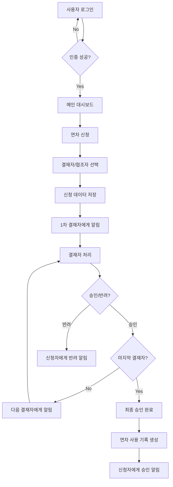

# 📋 연차관리 시스템 v3.0

> **Google Apps Script + Google Sheets 기반의 완전한 연차 관리 웹 애플리케이션**


## 🎯 프로젝트 개요

연차관리 시스템 v3.0은 중소기업을 위한 **완전한 웹 기반 연차 관리 솔루션**입니다. Google Apps Script와 Google Sheets를 활용하여 **무료로 구축**할 수 있으며, 강화된 보안 기능과 직관적인 사용자 인터페이스를 제공합니다.

### ✨ 핵심 가치

- 🆓 **완전 무료**: Google 플랫폼 기반으로 별도 서버나 라이선스 비용 없음
- 🔐 **강화된 보안**: 이메일 + 비밀번호 인증, SHA-256 암호화, 세션 관리
- 📱 **반응형 디자인**: 모바일/태블릿/데스크톱 모든 환경 지원
- ⚡ **실시간 알림**: 웹앱 알림 + 이메일 이중 알림 시스템
- 🎯 **유연한 워크플로우**: 누구든 결재자/협조자로 자유롭게 선택 가능

---

## 🚀 주요 기능

### 🔐 **인증 및 보안**

- **이메일 + 비밀번호** 로그인 시스템
- **SHA-256 비밀번호 암호화** 저장
- **세션 관리** (2시간 자동 만료)
- **비밀번호 변경** 기능
- **관리자/일반사용자** 권한 분리

### 📝 **연차 신청**

- **직관적인 연차 신청 폼**
- **연차/반차/특별휴가** 종류별 신청
- **자동 일수 계산** (반차 0.5일, 주말 제외)
- **유연한 결재자/협조자 선택** (전체 직원 대상)
- **실시간 직원 검색** 기능

### ✅ **결재 및 협조**

- **순차적 결재 프로세스**
- **결재 승인/반려** 처리
- **협조 의견** 수집
- **결재 현황 실시간 추적**
- **이메일 알림** 자동 발송

### 📊 **대시보드 및 조회**

- **개인 대시보드** (남은 연차, 대기 건수 등)
- **내 신청 현황** 조회
- **결재/협조 대기 목록**
- **연차 사용 이력** 관리
- **통계 및 분석** 기능

### 🔧 **관리자 기능**

- **직원 관리** (추가/수정/삭제)
- **부서 관리**
- **시스템 설정** (연차 정책 등)
- **비밀번호 초기화**
- **데이터 백업** 및 복원

---

## 🛠️ 기술 스택

### **백엔드**

- **Google Apps Script** - 서버리스 JavaScript 런타임
- **Google Sheets** - 데이터베이스 (10개 시트)
- **Gmail API** - 이메일 알림 발송

### **프론트엔드**

- **HTML5** - 시맨틱 마크업
- **CSS3** - 반응형 디자인, CSS Grid/Flexbox
- **Vanilla JavaScript** - 프레임워크 없는 순수 JS
- **Google Apps Script Client API** - 서버 통신

### **보안**

- **SHA-256** - 비밀번호 해싱
- **Session Management** - 세션 기반 인증
- **Input Validation** - 클라이언트/서버 이중 검증

---

## 📁 프로젝트 구조

```
📋 연차관리시스템_v3/
├── 📄 README.md                    # 프로젝트 개요 (이 파일)
├── 📄 prd.md                       # 상세 요구사항 문서
├── 📄 setup-guide.md               # 설치 및 배포 가이드
├── 📄 create_sheets_setup.md       # Google Sheets 설정 가이드
│
├── 🔧 Google Apps Script 파일들/
│   ├── 📄 Code.gs                  # 메인 백엔드 (인증, 라우팅)
│   ├── 📄 LeaveManagement.gs       # 연차 신청/결재 로직
│   ├── 📄 EmployeeManagement.gs    # 직원/부서 관리 로직
│   │
│   ├── 🌐 프론트엔드 파일들/
│   ├── 📄 login.html               # 로그인 페이지
│   ├── 📄 main.html                # 메인 애플리케이션 (JavaScript 포함)
│   └── 📄 error.html               # 오류 페이지
│
└── 📊 Google Sheets (10개 시트)/
    ├── 🏢 Departments              # 부서 정보
    ├── 👤 Employees                # 직원 정보 (로그인 계정 포함)
    ├── 📝 LeaveRequests            # 연차 신청 데이터
    ├── ✅ ApprovalSteps            # 결재 단계 정의
    ├── 📄 ApprovalLogs             # 결재 처리 이력
    ├── 🤝 CollaborationSteps       # 협조 단계 정의
    ├── 📄 CollaborationLogs        # 협조 처리 이력
    ├── 📊 LeaveUsage               # 연차 사용 기록
    ├── ⚙️ Settings                 # 시스템 설정
    └── 📈 Statistics               # 통계 데이터
```

---

## 🎯 데이터 흐름



---

## 🚀 빠른 시작

### 1️⃣ **사전 준비**

- Google 계정 (G Suite 또는 개인 계정)
- Google Drive, Gmail 접근 권한

### 2️⃣ **설치 (30분 소요)**

1. **Google Sheets 생성** - [📄 create_sheets_setup.md](create_sheets_setup.md) 참고
2. **Apps Script 프로젝트 생성** - [📄 setup-guide.md](setup-guide.md) 참고
3. **웹앱 배포** - 권한 설정 후 URL 생성
4. **초기 설정** - 관리자 계정 및 직원 정보 등록

### 3️⃣ **접속 및 사용**

```bash
# 웹앱 URL로 접속
https://script.google.com/macros/s/{DEPLOYMENT_ID}/exec

# 초기 관리자 계정
이메일: admin@company.com
비밀번호: temp123
```

### 4️⃣ **첫 설정**

1. 관리자 비밀번호 변경
2. 직원 정보 등록 (이메일 주소 필수)
3. 부서 정보 조정
4. 연차 정책 설정

---

## 📸 스크린샷

### 🔐 로그인 페이지

- 깔끔한 그라데이션 디자인
- 이메일 + 비밀번호 인증
- 반응형 모바일 지원

### 🏠 대시보드

- 개인 연차 현황 카드
- 최근 신청 내역 테이블
- 결재 대기 알림 배지

### 📝 연차 신청

- 직관적인 달력 선택
- 실시간 일수 계산
- 드롭다운 직원 선택

### ✅ 결재 처리

- 승인/반려 원클릭 처리
- 의견 입력 모달
- 실시간 상태 업데이트

---

## 🔧 커스터마이징

### **연차 정책 변경**

```javascript
// Settings 시트에서 수정 가능
기본연차일수: 15 → 20
최대연차일수: 25 → 30
세션타임아웃: 120 → 240 (분)
```

### **UI 테마 변경**

```css
/* main.html CSS 섹션에서 수정 */
:root {
  --primary-color: #667eea; /* 메인 컬러 */
  --secondary-color: #764ba2; /* 보조 컬러 */
  --success-color: #2ed573; /* 성공 컬러 */
  --danger-color: #ff4757; /* 위험 컬러 */
}
```

### **이메일 템플릿 변경**

```javascript
// LeaveManagement.gs > sendApprovalNotification() 함수에서 수정
const subject = `[연차관리] 결재 요청 - ${applicant.name}`;
const body = `사용자 정의 HTML 템플릿`;
```

---

## 🧪 테스트

### **자동 테스트 함수**

```javascript
// Apps Script 에디터에서 실행
createTestData(); // 테스트 데이터 생성
clearTestData(); // 테스트 데이터 삭제
```

### **수동 테스트 체크리스트**

- [ ] 로그인/로그아웃
- [ ] 연차 신청 (연차/반차/특별휴가)
- [ ] 결재 승인/반려
- [ ] 이메일 알림 수신
- [ ] 모바일 반응형 확인

---

## 🛡️ 보안 고려사항

### **구현된 보안 기능**

- ✅ **SHA-256 비밀번호 암호화**
- ✅ **세션 기반 인증 (2시간 만료)**
- ✅ **입력값 검증** (클라이언트 + 서버)
- ✅ **권한 분리** (관리자/일반사용자)
- ✅ **HTTPS 강제** (Google Apps Script 기본)

### **추가 보안 권장사항**

- 📌 **정기적 비밀번호 변경** 안내
- 📌 **접근 로그 모니터링**
- 📌 **백업 데이터 암호화**
- 📌 **2단계 인증** 고려 (향후 개발)

---

## 📈 성능 및 제약사항

### **Google Apps Script 제약**

- **실행 시간**: 6분 이내
- **트리거**: 일 20회 제한
- **동시 사용자**: 30명 권장
- **데이터 크기**: 시트당 200만 셀

### **권장 사용 규모**

- **직원 수**: 50명 이하
- **월 신청 건수**: 200건 이하
- **데이터 보관**: 3년 이내

### **성능 최적화 팁**

- 정기적 데이터 아카이빙
- 불필요한 알림 설정 최소화
- 대용량 첨부파일 지양

---

## 🔄 업데이트 및 유지보수

### **버전 히스토리**

- **v1.0** (2023): 기본 연차 신청/결재 기능
- **v2.0** (2024): 구글폼 기반 UI 개선
- **v3.0** (2024): 완전한 웹앱 + 강화된 보안 ⭐

### **향후 개발 계획**

- 📅 **달력 뷰** 연차 현황 시각화
- 📊 **고급 통계** 대시보드
- 🔔 **모바일 푸시 알림**
- 🤖 **챗봇 연동** (Slack, Teams)
- 🔐 **2단계 인증** 지원

### **유지보수 방법**

1. **정기 백업** (월 1회)
2. **권한 검토** (분기 1회)
3. **성능 모니터링** (월 1회)
4. **사용자 피드백** 수집 및 반영

---

## 🤝 기여 및 지원

### **기여 방법**

- 🐛 **버그 리포트**: Issues에 상세한 재현 단계 제출
- 💡 **기능 제안**: 사용자 시나리오와 함께 제안
- 🔧 **코드 기여**: Pull Request로 개선사항 제출
- 📖 **문서 개선**: 오타 수정, 예제 추가 등

### **지원 채널**

- 📧 **이메일**: support@company.com
- 💬 **Chat**: 사내 개발팀 채널
- 📞 **전화**: 내선 1234 (개발팀)

---

## 📄 라이선스

이 프로젝트는 **MIT 라이선스**를 따릅니다.

- ✅ 상업적 사용 가능
- ✅ 수정 및 배포 가능
- ✅ 개인적 사용 가능
- ❗ 라이선스 표기 필수

자세한 내용은 [LICENSE](LICENSE) 파일을 참고하세요.

---

## 🙏 감사의 말

이 프로젝트는 **Google Apps Script**와 **Google Workspace**의 강력한 플랫폼 덕분에 가능했습니다. 또한 사용자 피드백과 테스터들의 적극적인 참여에 깊이 감사드립니다.

**즐거운 연차 관리 되세요!** 🏖️✨

---

<div align="center">

**📋 연차관리 시스템 v3.0**

_Made with ❤️ by Development Team_

[](https://script.google.com/)
[](https://sheets.google.com/)
[](https://html.spec.whatwg.org/)
[](https://www.w3.org/Style/CSS/)
[](https://www.javascript.com/)

</div>
