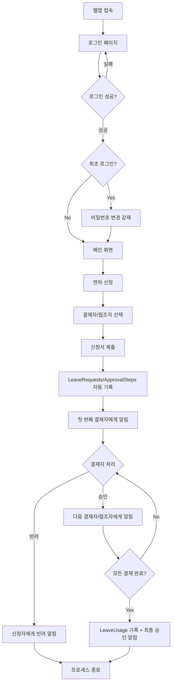

# 📋 연차관리 시스템 PRD v4.0 (관리자 분리 시스템 + 완전한 보안 강화)

---

## 🎯 1. 시스템 목표 및 핵심 가치

### **1.1 핵심 목표**

- **Google Apps Script 웹앱**으로 구현하는 완전한 연차관리 시스템
- **완전한 관리자 분리**: 직원과 관리자 시스템 완전 분리, 이중 로그인 시스템
- **강화된 보안**: SHA-256 암호화, 세션 관리, 권한 기반 접근 제어
- **누구든 결재자/협조자가 될 수 있는** 유연한 결재 시스템
- **관리자 폼 기반** 직관적 데이터 관리 (직원/부서/설정)
- **실시간 알림**: 로그인 알림 아이콘 + 이메일 알림
- 모든 기록과 이력을 **Google Sheets**에 투명하게 관리

### **1.2 핵심 가치**

- **완전한 분리**: 관리자와 직원 시스템 완전 분리로 보안 강화
- **보안성**: 이중 로그인, SHA-256 암호화, 세션 타임아웃 관리
- **유연성**: 고정된 조직도에 얽매이지 않는 자유로운 결재 라인
- **간편성**: 웹앱 UI로 누구나 쉽게 사용 가능
- **투명성**: 모든 과정이 기록되고 추적 가능
- **확장성**: 조직 변화에 쉽게 적응 가능한 구조

---

## 🏗️ 2. 시스템 아키텍처 및 기술 스택

### **2.1 기술 구성**

- **Frontend**: Google Apps Script HTML Service (HTML/CSS/JavaScript)
- **Backend**: Google Apps Script (서버사이드 JavaScript)
- **Database**: Google Sheets (10개 시트로 구성)
- **Authentication**: 이메일+비밀번호 기반 로그인
- **Notification**: MailApp.sendEmail + 웹앱 내 실시간 알림
- **Deployment**: Google Apps Script Web App

### **2.2 보안 정책 (v4.0 강화)**

- **이중 로그인 시스템**: 직원/관리자 완전 분리된 로그인
- **비밀번호 암호화**: SHA-256 해시로 저장
- **세션 관리**: 타입별 세션 분리 (`employee_session_`, `admin_session_`)
- **권한 분리**: SUPER/HR/DEPT 3단계 관리자 권한
- **접근 제어**: 로그인하지 않으면 시스템 접근 불가
- **세션 타임아웃**: 120분 자동 로그아웃
- **로그아웃 보안**: 완전한 세션 삭제 및 페이지 리다이렉트

---

## 👥 3. 사용자 역할 및 주요 기능

### **3.1 이중 로그인 시스템 (v4.0 신규)**

#### 🔐 **관리자/직원 분리 로그인**

- **직원 모드**: 기본 로그인 (파란색 테마)

  - Employees 시트에서 인증
  - 연차 신청 및 관리 기능 제공
  - `employee_session_` 세션 생성

- **관리자 모드**: 관리자 전용 로그인 (빨간색 테마)
  - Admins 시트에서 인증
  - 시스템 관리 전용 기능
  - `admin_session_` 세션 생성
  - 연차 기능 없음 (순수 관리 기능만)

#### 🔄 **로그인 모드 전환**

- **모드 토글 버튼**: "🔐 관리자 모드" / "👤 직원 모드로 전환"
- **시각적 구분**: 관리자 모드 시 빨간색 테마 적용
- **자동 입력값**: 관리자 모드 시 admin@company.com 자동 설정

#### 🔐 **웹앱 진입 및 인증**

- **첫 진입**: 웹앱 접속 시 로그인 페이지 자동 표시
- **로그인 방식**: 이메일 + 비밀번호 입력
- **최초 로그인**: 임시 비밀번호 → 강제 비밀번호 변경
- **세션 관리**: 타입별 세션 분리, 자동 로그아웃 (120분)

#### 🔑 **비밀번호 관리**

- **비밀번호 변경**: 내 정보 메뉴에서 언제든 변경 가능
- **비밀번호 분실**: 관리자에게 임시 비밀번호 요청
- **보안 정책**: 최소 8자, 영문+숫자 조합 권장

### **3.2 일반 직원**

#### 📝 **연차 신청 기능**

- **직관적인 연차 신청 폼** 사용
- **전체 직원 또는 부서별**에서 결재자/협조자 자유 선택
- **실시간 검색 기능**으로 빠른 직원 찾기
- 연차 종류(연차/반차/특별휴가) 선택
- **자동 일수 계산**: 연차=1일, 반차=0.5일, 특별휴가=실제일수
- 상세 사유 입력

#### 📊 **현황 확인 기능**

- 내가 신청한 연차 내역 및 상태(대기/승인/반려) 확인
- 남은 연차 일수 및 사용 이력 확인
- **로그인 시 알림 아이콘**으로 처리 결과 즉시 확인
- **이메일 알림**으로 최종 승인/반려 결과 수신

#### ⚙️ **개인 설정**

- **내 정보 관리**: 연락처, 부서 정보 확인
- **비밀번호 변경**: 현재 비밀번호 확인 후 새 비밀번호 설정

### **3.3 결재자/협조자 (모든 직원 가능)**

#### ✅ **결재/협조 처리 기능**

- 본인에게 할당된 결재/협조 건 **실시간 알림** (아이콘 + 이메일)
- **승인/반려 처리** 및 상세 코멘트 입력
- 결재 순서에 따른 **단계별 처리** 시스템
- 처리 내역 및 이력 확인

#### 🔄 **유연한 권한 시스템**

- **누구든 결재자/협조자** 될 수 있음 (부서장, 임원 구분 없음)
- 신청자가 **직접 적절한 결재자** 선택
- 프로젝트별, 상황별 **맞춤형 결재 라인** 구성 가능

### **3.4 관리자 (v4.0 완전 분리)**

#### 🔐 **관리자 전용 시스템**

- **완전 분리된 관리자 시스템**: 직원 기능과 100% 분리
- **관리자 전용 데이터베이스**: Admins 시트 별도 관리
- **3단계 권한 시스템**:
  - **SUPER**: 슈퍼관리자 (모든 권한)
  - **HR**: 인사관리자 (직원 관리 전용)
  - **DEPT**: 부서관리자 (부서별 관리)

#### 🏠 **관리자 전용 대시보드**

- **관리자 UI**: "🔐 이름 (관리자)" 표시
- **관리 전용 메뉴**:
  - 🔧 시스템 관리
  - ✅ 연차 승인 관리
  - 👥 사용자 관리
  - 📈 통계 및 보고서
- **연차 신청 메뉴 숨김**: 순수 관리 기능만 제공

#### 🏢 **조직 관리 기능 (폼 기반)**

- **직원 관리 폼**: 직원 추가/수정/삭제, 자동 ID 생성, 중복 검사
- **부서 관리 폼**: 부서 추가/수정/삭제, 소속 직원 확인
- **실시간 검색 및 필터링** 기능
- **유효성 검사** 자동 처리

#### 📈 **시스템 운영 관리**

- 연차 정책(발생 기준, 일수 등) 설정 및 변경
- 전체 연차 신청/이력/통계/잔여 연차 현황 확인
- 예외 상황(특별휴가, 수동 승인/반려, 기록 수정) 처리
- **자동 백업 시스템** 및 데이터 복구
- **월별/부서별/직원별 통계** 자동 생성
- 접근 권한 관리 및 개인정보 보호

---

## 🗄️ 4. 데이터 구조 및 시트 설계

### **4.1 필수 구글시트 생성 및 헤더 설정**

#### **📋 시트 생성 순서**

1. 구글시트 생성 → "연차관리시스템\_v3"로 이름 변경
2. 기본 "시트1" 삭제
3. 아래 **10개 시트**를 순서대로 생성
4. 각 시트 첫 번째 행(1행)에 헤더 입력

---

#### **🏢 1. Departments (부서 정보)**

```
시트명: Departments
A1: DeptID    B1: DeptName

초기 데이터 예시:
A2: 10        B2: 개발팀
A3: 20        B3: 영업팀
A4: 30        B4: 인사팀
A5: 40        B5: 총무팀
```

#### **👤 2. Employees (직원 정보)**

```
시트명: Employees
A1: EmpID     B1: Name      C1: Email           D1: Phone
E1: DeptID    F1: JoinDate  G1: Position        H1: PasswordHash

초기 직원 데이터 예시:
A2: 1001      B2: 김철수    C2: kim@company.com    D2: 010-1111-1111
E2: 10        F2: 2023-01-01  G2: 개발자           H2: (시스템에서 자동 생성)
A3: 1002      B3: 이영희    C3: lee@company.com    D3: 010-2222-2222
E3: 20        F3: 2023-02-01  G3: 영업대리         H3: (시스템에서 자동 생성)
```

#### **🔐 2-1. Admins (관리자 정보) - v4.0 핵심 기능**

```
시트명: Admins
A1: AdminID   B1: Name      C1: Email              D1: Phone           E1: Role
F1: JoinDate  G1: PasswordHash  H1: LastLogin     I1: LoginCount

초기 관리자 계정 설정:
A2: ADMIN001  B2: 시스템관리자  C2: admin@company.com  D2: 010-0000-0000  E2: SUPER
F2: 2024-01-01  G2: (비워둠)   H2: (비워둠)     I2: 0

⚠️ 중요: PasswordHash는 비워두고, 시스템에서 temp123으로 자동 설정됩니다.

관리자 역할(Role) 구분:
- SUPER: 슈퍼관리자 (모든 권한, 시스템 설정 변경 가능)
- HR: 인사관리자 (직원/부서 관리 전용)
- DEPT: 부서관리자 (부서별 연차 승인 관리)

보안 특징:
- 직원 시스템과 완전 분리된 별도 데이터베이스
- 관리자 로그인 추적 (LastLogin, LoginCount)
- SHA-256 암호화된 비밀번호 저장
```

#### **📝 3. LeaveRequests (연차 신청)**

```
시트명: LeaveRequests
A1: ReqID     B1: EmpID     C1: StartDate   D1: EndDate     E1: Days
F1: LeaveType G1: Reason    H1: Status      I1: SubmitDate

* 이 시트는 헤더만 입력하고 데이터는 자동 생성됩니다
* Days 컬럼 계산: 연차=1.0, 반차=0.5, 특별휴가=실제 일수
```

#### **✅ 4. ApprovalSteps (결재 단계)**

```
시트명: ApprovalSteps
A1: ReqID     B1: GroupID   C1: ApproverID  D1: StepOrder

* GroupID는 항상 null로 입력됩니다 (전체 직원 선택 방식)
* 이 시트는 헤더만 입력하고 데이터는 자동 생성됩니다
```

#### **📋 5. ApprovalLogs (결재 이력)**

```
시트명: ApprovalLogs
A1: ReqID     B1: ApproverID  C1: Result    D1: DateTime    E1: Comment

* 이 시트는 헤더만 입력하고 데이터는 자동 생성됩니다
```

#### **🤝 6. CollaborationSteps (협조 단계)**

```
시트명: CollaborationSteps
A1: ReqID     B1: CollaboratorID  C1: StepOrder

* 이 시트는 헤더만 입력하고 데이터는 자동 생성됩니다
```

#### **📝 7. CollaborationLogs (협조 이력)**

```
시트명: CollaborationLogs
A1: ReqID     B1: CollaboratorID  C1: Result    D1: DateTime    E1: Comment

* 이 시트는 헤더만 입력하고 데이터는 자동 생성됩니다
```

#### **📊 8. LeaveUsage (연차 사용 기록)**

```
시트명: LeaveUsage
A1: ReqID     B1: EmpID     C1: UsedDays    D1: RegisterDate

* 이 시트는 헤더만 입력하고 데이터는 자동 생성됩니다
```

#### **⚙️ 9. Settings (시스템 설정)**

```
시트명: Settings
A1: Key       B1: Value

필수 설정값 입력:
A2: 연차발생기준    B2: 입사일 기준
A3: 연차발생주기    B3: 매년
A4: 기본연차일수    B4: 15
A5: 최대연차일수    B5: 25
A6: 세션타임아웃    B6: 120

* 세션타임아웃: 120분(2시간) - 로그인 상태 유지 시간
```

#### **📈 10. Statistics (월별 통계)**

```
시트명: Statistics
A1: Year      B1: Month     C1: EmpID       D1: UsedDays    E1: RemainDays

* 이 시트는 헤더만 입력하고 데이터는 자동 생성됩니다
```

---

#### **⚡ 빠른 설정 체크리스트**

**🔴 수동 입력 필요 (데이터 입력하세요!)**

- [ ] Departments (부서 정보 입력)
- [ ] Employees (관리자 계정 입력)
- [ ] Settings (시스템 설정값 입력)

**🟢 헤더만 입력 (자동 생성)**

- [ ] LeaveRequests
- [ ] ApprovalSteps
- [ ] ApprovalLogs
- [ ] CollaborationSteps
- [ ] CollaborationLogs
- [ ] LeaveUsage
- [ ] Statistics

**❌ 삭제된 시트 (만들지 마세요!)**

- ApprovalGroups
- ApprovalGroupMembers

### **4.2 핵심 시트별 상세 구조**

#### **🚀 빠른 시작 가이드 - 구글시트 설정**

**1단계: 구글시트 생성**

1. 구글 드라이브 → 새로 만들기 → Google Sheets
2. 파일명을 "연차관리시스템\_v3"로 변경

**2단계: 시트 생성 (총 10개)**

1. 기본 "시트1" 삭제
2. 우하단 "+" 버튼 클릭하여 새 시트 생성
3. 시트명을 위의 **4.1**에서 제시한 이름으로 변경

**3단계: 헤더 입력**

- 각 시트의 A1, B1, C1... 셀에 헤더 내용 복사 붙여넣기

**4단계: 초기 데이터 입력**

- **Departments**: 부서 정보 입력 (개발팀, 영업팀 등)
- **Employees**: 관리자 계정 1개 이상 입력
- **Settings**: 연차 정책 설정값 입력
- **나머지 7개 시트**: 헤더만 입력하고 데이터는 자동 생성됨

**5단계: 권한 설정**

- 구글시트 → 공유 → Apps Script 프로젝트와 연동

### **4.3 시트별 관리 방식 및 초기 설정**

#### **📋 수동 입력 필요 시트**

1. **Departments**: 관리자 폼 또는 직접 입력
2. **Employees**: 관리자 폼 또는 직접 입력 (PasswordHash는 시스템에서 자동 생성)
3. **Settings**: 직접 입력 (연차 정책 및 시스템 설정)

#### **🤖 자동 생성 시트**

- **LeaveRequests, ApprovalSteps, ApprovalLogs**: 연차 신청 시 자동 생성
- **CollaborationSteps, CollaborationLogs**: 협조자 설정 시 자동 생성
- **LeaveUsage**: 연차 승인 시 자동 기록
- **Statistics**: 관리자 메뉴에서 통계 생성 실행 시 자동 생성

#### **💾 데이터 예시**

**LeaveRequests (연차 신청)**

```
ReqID        | EmpID | StartDate  | EndDate    | Days | LeaveType | Reason    | Status | SubmitDate
20240701-001 | 1001  | 2024-07-10 | 2024-07-12 | 3    | 연차      | 개인사유  | 대기   | 2024-07-01
20240701-002 | 1002  | 2024-07-15 | 2024-07-15 | 0.5  | 반차      | 병원진료  | 승인   | 2024-07-02
20240701-003 | 1003  | 2024-07-20 | 2024-07-20 | 1    | 연차      | 휴식      | 승인   | 2024-07-03
```

**ApprovalSteps (결재 단계)** - 전체 직원 선택 방식

```
ReqID        | GroupID | ApproverID | StepOrder
20240701-001 | null    | 1002       | 1
20240701-001 | null    | 1003       | 2
```

_GroupID는 사용하지 않음 (전체 직원 선택 방식)_

**ApprovalLogs (결재 이력)**

```
ReqID        | ApproverID | Result | DateTime         | Comment
20240701-001 | 1002       | 승인   | 2024-07-02 09:00 | 이상 없음
20240701-001 | 1003       | 승인   | 2024-07-02 14:00 | 승인합니다
```

---

## 🎨 5. 웹앱 UI/UX 및 화면 흐름

### **5.1 웹앱 진입 및 로그인 프로세스**

#### **Step 1: 웹앱 최초 접속**

1. **Google Apps Script Web App URL** 접속
2. **로그인 페이지** 자동 표시
   - 이메일 입력 필드
   - 비밀번호 입력 필드
   - "로그인" 버튼
   - "비밀번호 찾기" 링크

#### **Step 2: 로그인 인증**

1. **이메일 + 비밀번호** 입력
2. **시스템 인증** (Employees 시트 대조)
3. **성공 시**: 세션 생성 → 메인 화면 진입
4. **실패 시**: 에러 메시지, 5회 실패 시 임시 잠금

#### **Step 3: 최초 로그인 시 비밀번호 변경**

1. **임시 비밀번호** 사용자 → 강제 비밀번호 변경 화면
2. **새 비밀번호** 2회 입력 → 변경 완료
3. **메인 화면** 진입

### **5.2 메인 화면 구조**

#### **헤더 영역**

- **좌측**: 시스템 로고/제목
- **우측**:
  - 🔴 **알림 아이콘** (처리할 건 있을 때)
  - 👤 **사용자명** (드롭다운: 내 정보, 비밀번호 변경, 로그아웃)

#### **메뉴 영역 (일반 직원)**

- 📝 **연차 신청**
- 📊 **내 신청 현황**
- ✅ **결재/협조 처리**
- ⚙️ **내 정보** (비밀번호 변경)

#### **메뉴 영역 (관리자)**

- 📝 **연차 신청**
- 📊 **내 신청 현황**
- ✅ **결재/협조 처리**
- 🏢 **관리자 메뉴**
  - 👤 직원 관리
  - 🏢 부서 관리
  - ⚙️ 시스템 설정
  - 📈 통계/백업
  - 🔑 비밀번호 관리

### **5.3 연차 신청 프로세스**

#### **Step 1: 연차 신청 폼**

1. **📝 연차 신청** 메뉴 클릭
2. **신청 폼** 표시:
   - 시작일/종료일 (캘린더 위젯)
   - 연차 종류 (연차/반차/특별휴가)
   - 신청 사유 (텍스트 영역)

#### **Step 2: 결재자/협조자 선택**

1. **"결재자 추가"** 버튼 클릭
2. **직원 선택 모달** 표시:
   - 🟢 **전체 직원** 탭
   - 🔵 **부서별** 탭 (개발팀, 영업팀 등)
3. **실시간 검색** 기능
4. **직원 선택** → 결재 순서 지정
5. **협조자 선택** (선택사항)

#### **Step 3: 신청 완료**

1. **"신청하기"** 버튼 클릭
2. 시스템 자동 처리:
   - LeaveRequests 기록
   - ApprovalSteps/CollaborationSteps 생성
   - 첫 번째 결재자에게 알림 발송

### **5.4 비밀번호 관리 프로세스**

#### **일반 사용자 비밀번호 변경**

1. **내 정보** → **비밀번호 변경** 클릭
2. **비밀번호 변경 폼**:
   - 현재 비밀번호
   - 새 비밀번호
   - 새 비밀번호 확인
3. **변경 완료** → 즉시 적용

#### **관리자 비밀번호 관리**

1. **관리자 메뉴** → **비밀번호 관리** 클릭
2. **기능 목록**:
   - 관리자 비밀번호 변경
   - 직원 임시 비밀번호 발급
   - 로그인 실패 계정 잠금 해제

### **5.5 알림 시스템**

#### **실시간 알림 아이콘**

```
🔴 알림 아이콘 (우상단)
├── 결재 대기: 3건
├── 협조 대기: 1건
└── 처리 완료: 2건
```

#### **이메일 알림**

- **결재/협조 할당**: 즉시 발송
- **최종 승인/반려**: 신청자에게 발송
- **HTML 템플릿**: 깔끔한 디자인

### **5.6 로그아웃 시스템 (v4.0 강화)**

#### **완전한 로그아웃 프로세스**

1. **세션 완전 삭제**: 서버에서 관리자/직원 세션 타입별 삭제
2. **HTML 직접 교체**: 서버에서 로그인 페이지 HTML을 가져와 현재 페이지 교체
3. **폴백 메커니즘**: HTML 교체 실패 시 URL 리다이렉트로 대체
4. **사용자 피드백**: 로그아웃 진행 상황 알림 및 로딩 표시

#### **기술적 구현**

- `doLogout()`: 서버 세션 삭제
- `getLoginPageAfterLogout()`: 로그인 페이지 HTML 반환
- `document.open/write/close()`: 페이지 전체 HTML 교체
- 빈 화면 문제 완전 해결

### **5.7 모바일 최적화**

- **반응형 디자인**: 모바일/태블릿/데스크톱 모두 지원
- **터치 친화적 UI**: 버튼 크기 최적화
- **빠른 처리**: 원클릭 승인/반려

---

## 📧 6. 알림 시스템 설계 (로그인 + 이메일)

### **6.1 알림 전략**

#### **무료 & 효과적인 알림 조합**

- ✅ **로그인 알림 아이콘**: 실시간, 즉시성, 무료
- ✅ **이메일 알림**: 확실한 전달, 기록 보존, 무료
- ❌ **유료 SMS/카카오톡**: 비용 부담으로 제외

#### **알림 타이밍**

```
연차 신청 → 첫 번째 결재자에게 즉시 알림
결재 완료 → 다음 결재자 또는 협조자에게 알림
최종 완료 → 신청자에게 결과 알림
```

### **6.2 기술적 구현**

#### **이메일 알림 시스템**

- **Apps Script**의 `MailApp.sendEmail()` 활용
- **HTML 템플릿** 지원으로 깔끔한 디자인
- **자동 발송** (결재/협조 할당, 최종 승인/반려 시)

#### **로그인 알림 아이콘**

- **30초마다 자동 확인** (JavaScript setInterval)
- **빨간 원형 아이콘** (🔴) 우상단 고정 위치
- **클릭 시 상세 내용** 표시

---

## 🚀 7. 시스템 특장점 및 확장성

### **7.1 핵심 특장점**

#### **🔐 강화된 보안 시스템**

- **로그인 인증**: 이메일+비밀번호 기반 사용자 인증
- **비밀번호 암호화**: SHA-256 해시로 안전한 저장
- **세션 관리**: 자동 로그아웃, 세션 타임아웃 설정
- **권한 분리**: 관리자/일반 사용자 구분, 접근 제어

#### **🔄 유연한 결재 시스템**

- **누구든 결재자/협조자** 가능 (부서장, 임원 구분 없음)
- **프로젝트별 맞춤 결재라인** 구성
- **실시간 검색**으로 빠른 직원 찾기
- **중복 방지** 및 **순서 지정** 자동 처리

#### **📊 폼 기반 관리 시스템**

- **직원 관리 폼**: 자동 ID 생성, 중복 검사, 유효성 검사
- **부서 관리 폼**: 안전한 삭제, 소속 직원 확인
- **비밀번호 관리**: 관리자의 임시 비밀번호 발급 기능
- **더 이상 수동 시트 입력 불필요**

#### **🎯 사용자 친화적 웹앱 UI/UX**

- **Google Apps Script 웹앱** 기반 완전한 웹 인터페이스
- **모바일 최적화** 반응형 디자인
- **원클릭 승인/반려** 처리
- **실시간 알림 아이콘** + **이메일 알림**

### **7.2 실무적 유용성**

#### **📈 대시보드 & 분석**

- **실시간 통계**: 총 직원 수, 대기 중인 신청, 이번 달 신청, 승인률
- **개인 대시보드**: 내 연차 잔여일, 사용 이력, 신청 현황 한눈에 확인
- **부서별 현황**: 부서별 연차 사용 패턴 분석
- **월별/연도별 트렌드** 자동 생성

#### **🔍 검색 & 필터링**

- **기간별 검색**: 특정 기간 내 신청/승인 내역
- **부서별 필터**: 부서별 연차 현황 확인
- **직원별 이력**: 개별 직원의 연차 사용 패턴
- **상태별 정렬**: 대기/승인/반려 상태별 분류

#### **⚙️ 자동화 기능**

- **연차 발생 자동 계산**: 입사일 기준 연차 자동 산정
- **잔여 연차 실시간 업데이트**: 사용 시마다 자동 차감
- **월말 통계 자동 집계**: 관리자 메뉴에서 원클릭 생성
- **만료 연차 자동 처리**: 연말 자동 정산

### **7.3 관리 편의성**

#### **🛡️ 데이터 보안 & 백업**

- **자동 백업 시스템**: Google Drive 연동 일일 백업
- **버전 관리**: 변경 이력 자동 추적
- **접근 권한 관리**: 로그인 기반 안전한 접근 제어
- **개인정보 보호**: 비밀번호 암호화, 민감정보 접근 제한

#### **🔧 예외 처리**

- **특별휴가 처리**: 경조사, 병가 등 별도 관리
- **수동 승인/반려**: 관리자 직접 처리 가능
- **기록 수정**: 오류 발생 시 관리자 수정 권한
- **긴급 처리**: 급한 연차 신청 즉시 처리
- **비밀번호 초기화**: 관리자의 임시 비밀번호 발급

### **7.4 확장성 설계**

#### **🔗 외부 연동 준비**

- **Google Calendar 연동**: 승인된 연차 자동 캘린더 등록
- **Slack/Teams 알림**: 팀 채널 알림 추가 가능
- **모바일 앱 연동**: PWA(Progressive Web App) 변환 가능
- **API 연동**: 타 시스템과의 데이터 연동

#### **📱 미래 확장 아이디어**

- **AI 기반 연차 추천**: 팀 일정 고려한 최적 연차 시기 제안
- **워크플로우 자동화**: 반복적인 승인 패턴 학습 후 자동 처리
- **화상 회의 연동**: 연차 중 긴급 회의 참여 옵션
- **출입 시스템 연동**: 연차 기간 자동 출입 제한

### **7.5 비용 효율성**

#### **💰 완전 무료 운영**

- **Google Workspace 기본 기능** 활용
- **추가 라이선스 비용 없음**
- **서버 운영비 없음**
- **유지보수 최소화**

#### **⏱️ 빠른 도입**

- **설정 시간**: 2-3시간 (로그인 시스템 포함)
- **교육 시간**: 30분 (직관적 웹앱 UI)
- **데이터 마이그레이션**: 기존 엑셀 데이터 쉽게 이전
- **즉시 운영 가능**

---

## 🔄 8. 전체 시스템 흐름

### **8.1 웹앱 진입부터 연차 승인까지 전체 프로세스**



### **8.2 단계별 상세 흐름**

#### **1단계: 웹앱 진입 및 로그인**

1. 🌐 **Google Apps Script 웹앱 URL 접속**
2. 🔐 **로그인 페이지 자동 표시**
3. 📧 **이메일 + 비밀번호 입력**
4. ✅ **인증 성공 → 세션 생성**
5. 🔑 **최초 로그인 시 비밀번호 변경 강제**

#### **2단계: 메인 화면 및 연차 신청**

1. 🏠 **메인 화면 진입 (알림 아이콘, 메뉴 표시)**
2. 📝 **연차 신청 메뉴 클릭**
3. 📅 **시작일/종료일, 연차 종류, 사유 입력**
4. 👥 **전체 직원/부서별에서 결재자/협조자 선택**
5. ✅ **신청서 제출 → 자동 유효성 검사**

#### **3단계: 시스템 자동 처리**

1. 💾 **LeaveRequests 시트에 신청 내용 자동 기록**
2. 🔄 **ApprovalSteps, CollaborationSteps 자동 생성**
3. 📧 **첫 번째 결재자에게 즉시 이메일 알림 발송**
4. 🔴 **결재자 로그인 시 알림 아이콘 활성화**

#### **4단계: 결재 처리**

1. 👤 **결재자가 웹앱 로그인 (알림 확인)**
2. 📋 **결재 대기 목록에서 신청 내용 확인**
3. ✅❌ **승인/반려 처리 + 코멘트 입력**
4. 📝 **ApprovalLogs에 처리 결과 자동 기록**

#### **5단계: 최종 처리 및 알림**

- **승인 시**: 다음 결재자 또는 협조자에게 알림
- **반려 시**: 신청자에게 즉시 반려 알림 + 프로세스 종료
- **최종 승인 시**: LeaveUsage 기록 + 신청자에게 최종 승인 알림

### **8.3 핵심 개선사항 요약**

#### **✅ Before (기존 방식)**

- Google Sheets 메뉴 기반 접근
- 복잡한 ApprovalGroups 설정
- 수동 시트 입력으로 데이터 관리
- 보안 취약 (시트 직접 접근)

#### **🚀 After (웹앱 v3.0)**

- **Google Apps Script 웹앱** 완전한 웹 인터페이스
- **로그인 인증 시스템** 강화된 보안
- **전체 직원 선택 방식**으로 단순화
- **관리자 폼 기반** 직관적 데이터 관리
- **비밀번호 관리** 기능 내장

### **8.4 시스템 장점 총정리**

| 구분            | 특징                         | 장점                    |
| --------------- | ---------------------------- | ----------------------- |
| **보안성**      | 로그인 인증, 비밀번호 암호화 | 안전한 데이터 보호      |
| **사용 편의성** | 웹앱 UI, 실시간 검색         | 중학생도 쉽게 사용 가능 |
| **관리 편의성** | 폼 기반 관리, 자동 ID 생성   | 관리자 업무 부담 최소화 |
| **유연성**      | 전체 직원 선택 방식          | 조직 변화에 즉시 대응   |
| **비용 효율성** | Google 무료 도구 활용        | 완전 무료 운영          |
| **확장성**      | 웹앱 기반 모듈화 구조        | 추후 기능 확장 용이     |

---

## 🎉 9. 결론

이 **연차관리 시스템 v4.0**은 **완전한 관리자 분리 시스템**과 **강화된 보안**을 통해 기업급 수준의 연차관리 솔루션으로 발전했습니다.

---

## 🚀 10. v4.0 빠른 설정 가이드

### **10.1 Admins 시트 설정 (필수)**

#### **1단계: Admins 시트 생성**

```
시트명: Admins
헤더: AdminID | Name | Email | Phone | Role | JoinDate | PasswordHash | LastLogin | LoginCount
```

#### **2단계: 초기 관리자 계정 추가**

```
A2: ADMIN001
B2: 시스템관리자
C2: admin@company.com
D2: 010-0000-0000
E2: SUPER
F2: 2024-01-01
G2: (비워둠)
H2: (비워둠)
I2: 0
```

### **10.2 관리자 로그인 방법**

1. **웹앱 접속** → 로그인 페이지
2. **"🔐 관리자 모드" 버튼 클릭** (빨간색 테마로 변경)
3. **이메일**: admin@company.com (자동 입력됨)
4. **비밀번호**: temp123 (최초 로그인용)
5. **로그인 후 비밀번호 변경** 필수

### **10.3 직원 로그인 방법**

1. **웹앱 접속** → 로그인 페이지 (기본: 직원 모드)
2. **직원 이메일 + 비밀번호** 입력
3. **연차 관리 기능** 사용

### **10.4 주요 차이점**

| 구분             | 직원 모드           | 관리자 모드      |
| ---------------- | ------------------- | ---------------- |
| **테마**         | 파란색              | 빨간색           |
| **데이터베이스** | Employees 시트      | Admins 시트      |
| **세션**         | employee*session*   | admin*session*   |
| **메뉴**         | 연차 신청/현황/결재 | 시스템 관리 전용 |
| **표시**         | 👤 이름             | 🔐 이름 (관리자) |

### **v4.0 핵심 성과**

- ✅ **완전한 관리자 분리**: 직원과 관리자 시스템 100% 분리
- ✅ **이중 로그인 시스템**: 보안 강화된 관리자/직원 별도 인증
- ✅ **3단계 관리자 권한**: SUPER/HR/DEPT 역할 기반 접근 제어
- ✅ **강화된 세션 관리**: 타입별 세션 분리 및 완전한 로그아웃
- ✅ **관리자 전용 UI**: 연차 기능 제거, 순수 관리 기능만 제공
- ✅ **로그아웃 문제 해결**: HTML 직접 교체로 빈 화면 문제 완전 해결

### **보안 강화 특징**

- **SHA-256 암호화**: 관리자/직원 비밀번호 별도 암호화
- **세션 분리**: `admin_session_`, `employee_session_` 완전 분리
- **로그인 추적**: 관리자 활동 로그 및 로그인 횟수 추적
- **자동 로그아웃**: 120분 세션 타임아웃
- **완전한 로그아웃**: 서버 세션 삭제 + 페이지 HTML 교체

### **v4.0 주요 개선사항**

#### **🔐 완전한 보안 시스템**

- **이중 로그인**: 관리자/직원 완전 분리된 인증 시스템
- **3단계 권한**: SUPER/HR/DEPT 역할 기반 접근 제어
- **세션 분리**: 타입별 세션 관리로 보안 강화
- **로그아웃 완성**: 빈 화면 문제 완전 해결

#### **🎯 사용자 경험 개선**

- **직관적 UI**: 관리자 모드 시각적 구분 (빨간색 테마)
- **자동 입력**: 관리자 모드 시 계정 정보 자동 설정
- **완전한 분리**: 관리자는 연차 기능 없는 순수 관리 화면
- **안정적 로그아웃**: HTML 직접 교체로 확실한 페이지 전환

#### **🌐 웹앱 기반**

- Google Apps Script Web App 배포
- 모바일/태블릿/데스크톱 반응형 지원
- 브라우저만 있으면 어디서든 접근 가능
- 별도 설치 프로그램 불필요

#### **⚡ 효율성**

- 폼 기반 직관적 데이터 관리
- 실시간 알림 및 이메일 연동
- 자동 백업 및 통계 생성
- 완전 무료 운영

### **구현 가이드**

1. **Google Sheets 생성** (10개 시트, Employees에 PasswordHash 컬럼 추가)
2. **Google Apps Script 프로젝트** 생성 및 웹앱 코드 구현
3. **로그인 시스템** 구현 (인증, 세션 관리, 비밀번호 처리)
4. **HTML/CSS/JavaScript** 웹앱 UI 구현
5. **웹앱 배포** 및 URL 공유

### **더 이상 필요 없는 파일들**

이제 하나의 완전한 PRD 파일로 모든 내용이 통합되었으므로 다른 파일들은 삭제하셔도 됩니다:

- ✅ **implementation_guide.md**: 구현 가이드는 PRD에 통합됨
- ✅ **updated_sheet_guide.md**: 데이터 구조는 PRD에 통합됨

이제 **보안이 강화된 완전한 웹 애플리케이션** 형태의 연차관리 시스템을 구축할 수 있습니다! 🚀

**추가 질문이나 구현 중 문제가 있으면 언제든 말씀해 주세요!** 💪
